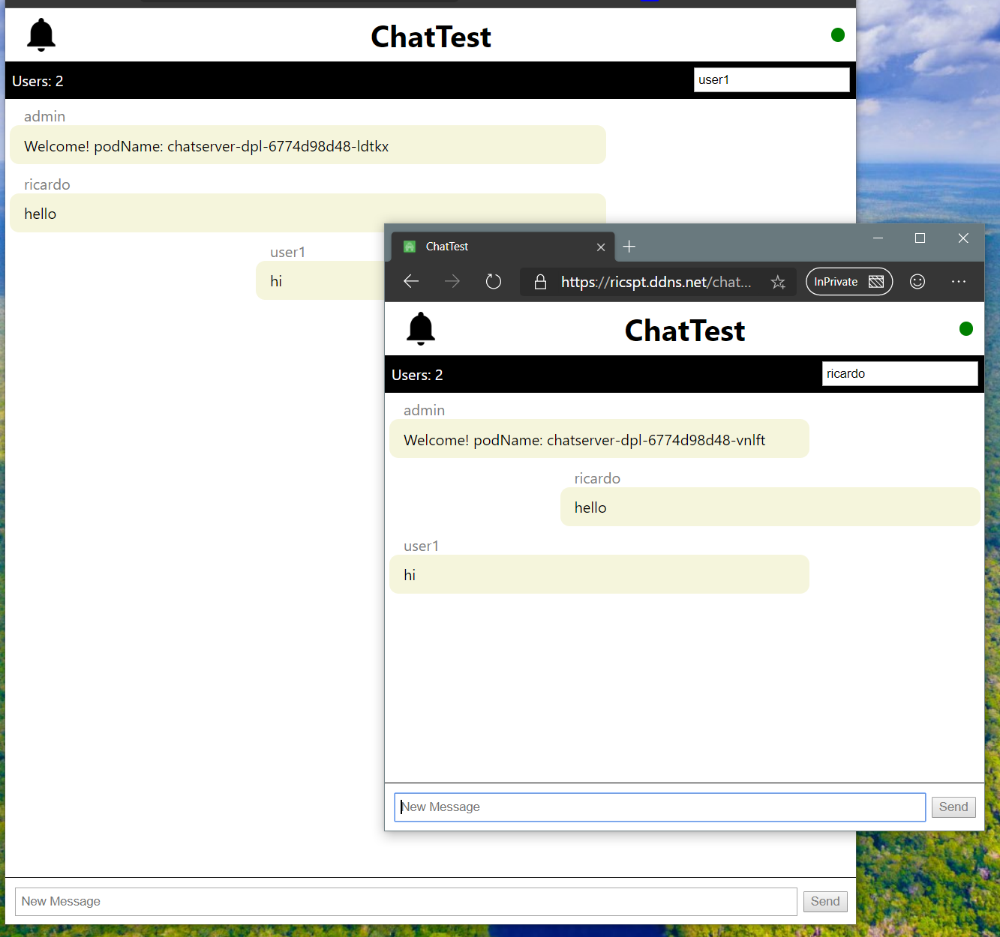

# SignalR Chat Frontend 

This project was built with the idea of testing WebSockets (in this specific case SignalR) deployed with kubernetes in a scalable scenario with multiple containers (chat-backend app) running side by side.

It is a real time chat app serviced by SignalR in asp.net core.

# This project has two parts:

## A backend (chat-backend) built with asp.net core (C#):
Has the job to connect multiple clients to the same context.
As this is a scalable scenario a redis container is used to connect the different containers (chat-backend). 

## A client (chat-frontend) built with ReactJS and Typescript:
The client side has the ui for the chat and all the core required for receive and send messages to the backend.

# Docker, Kubernetes and Azure Pipelines:

Both parts of this project are built with docker and then deployed using kubernetes into a home cluster. The build and deployment are managed with azure pipelines.

# Project online at:

WebApp online in: https://ricspt.ddns.net/chat/frontend/

Backend online in: https://ricspt.ddns.net/chat/backend/api/version